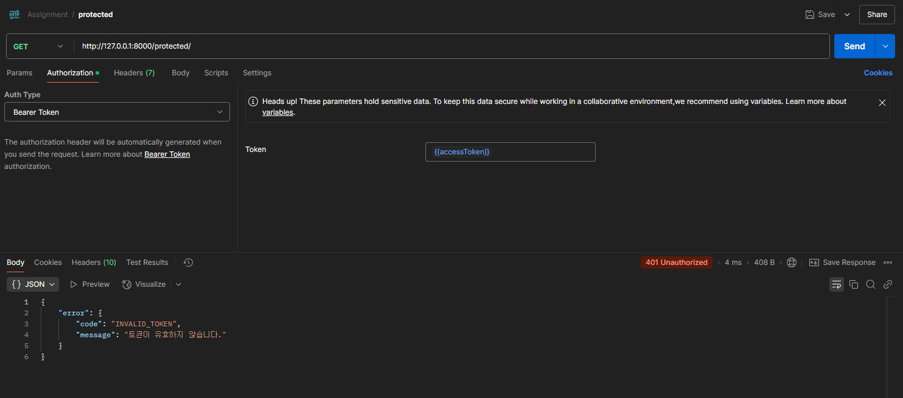

# Pre-assignment

이 프로젝트는 Django를 기반으로 작성된 API 서버이며, AWS EC2에 배포되어 있습니다.
배포 환경은 **uWSGI**와 **Nginx**를 사용하여 운영되고 있으며, API 문서는 Swagger UI를 통해 제공됩니다.

## 배포 환경

- **서버:** AWS EC2 (Ubuntu)
- **퍼블릭 IPv4 주소:** `15.164.229.68`
- **API 문서 URL:** [http://15.164.229.68/swagger](http://15.164.229.68/swagger)
- **애플리케이션:** Django
- **WSGI 서버:** uWSGI
- **웹 서버:** Nginx

## 기능

- Django 기반 API 서비스 제공
- Swagger UI를 통한 API 문서화 (drf-yasg 사용)
- 정적 파일은 Nginx를 통해 서빙
- uWSGI와 systemd를 사용하여 백그라운드 서비스로 실행

# 프로젝트 코드 클론 
- git clone https://github.com/PSG4160/Pre_assignment
- cd Pre_assignment

# API 테스트 결과 (with Postman)

---

## 1. 회원가입

- **API URL:** `POST /signup/` 
- **정상 요청** 

- **회원가입 실패한 경우** 

## 2. 로그인

- **API URL:** `POST /login/` 
- **정상 요청**

- **로그인 실패한 경우** 

## 3. 토큰 테스트

- **API URL:** `GET /protected/` 
- **정상 요청**

- **토큰 유효하지 않은 경우** 

- **토큰 만료된 경우** 

- **토큰이 없는 경우** 

